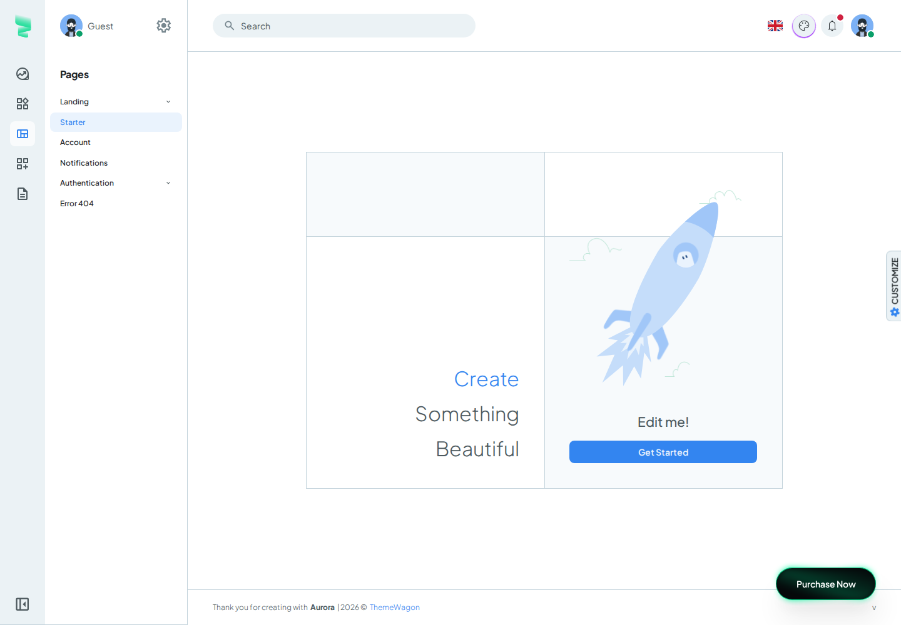

# Aurora layout migration: working plan and source inventory

This is a requested planning artifact, not documentation of implemented product behavior.
Phase 1 covers the reference, source/dependency inventory, cleanup conditions and agent
guidance. Application integration starts in phase 2. Module redesign requires separate
user acceptance of the completed shell with the existing CRUD still working.

## Current checkpoint

Phases 1, 2 and 3 are complete. Phase 4 technical integration review is complete;
user visual acceptance is pending and module redesign has not started.

- [AdminLayout](../../apps/admin/src/layout/admin-layout.tsx) uses the original Aurora
  Sidenav / Stacked presentation and local search/language/theme/notification/profile menus.
  Store and navigation inputs remain plain props; layout has no Refine, GraphQL or router imports.
- [StoreWorkspace](../../apps/admin/src/features/stores/store-workspace.tsx) retains store
  discovery, URL navigation, Reference availability, loading/error/empty states and the
  keyed feature subtrees. Product and Reference editors retain their existing lifecycle.
- Seven direct shell dependencies are installed at the reference versions. Existing React,
  React Router, Refine and Ant Design versions remain unchanged. Icons, font and avatars
  are local; unrelated Aurora demo packages and providers are excluded.
- The old header/sidebar CSS has been replaced. Existing Ant Design pages remain on their
  light content surface; existing providers, feature CSS and CRUD behavior remain protected.
- Temporary example avatars are grouped under `apps/admin/public/temp/avatar`; local demo
  data references `/temp/avatar/` so the shell still serves them in development and builds.
- Phase 3 baseline: root lint/typecheck/build passed, with 13 selected component and 13 browser cases.
  Search focus/labels and the default primary-color checkmark were corrected during review.
  The shared Emotion CSSOM cache resolved slow Ant Design head scans without test mocks,
  timeout changes or removed assertions. Original and integrated shell captures were reviewed
  at matching sizes, including menus, hover, mobile drawer and dark mode.
- The lockfile adds 42 package entries, with no existing package version changes or removals.
  Build still reports a large main chunk: about 2.78 MB minified / 834 KB gzip. Both UI
  libraries remain while legacy CRUD is present; the warning is not suppressed.
- Phase 4 verified 8 store workspace component cases and 15 distinct browser cases.
  Search positioning/focus and notification action focus were corrected without dependencies.
- Next: user visual acceptance at `http://127.0.0.1:11081`. Phase 5 starts with Products
  only after acceptance; the user's approval has not been inferred from passing tests.

## Phase 4 integration review

- Search now anchors to the current desktop control and tracks the top bar's width
  transition with a scoped `ResizeObserver`. Switching between mobile and desktop keeps
  the search text; closing returns keyboard focus to the current trigger.
- Notification read/remove actions restore focus inside the panel when their control is
  disabled or removed. Escape closes the panel and returns to the bell button.
- Two additional browser cases cover 899/900 and 1199/1200 px boundaries, open overlays,
  preserved Event drafts, search navigation confirmation, and cancelled/confirmed store
  switching. Existing menu assertions now verify focus after notification actions.
- Profile capture waits for the opening transition to finish. The missing text in the
  earlier capture was a capture-timing issue; the rendered colors and profile component
  required no change.
- Application changes are limited to search and notifications. No dependencies, CRUD
  presentation, GraphQL contracts or persistence behavior are changed in this phase.
- The existing development servers remain on their standard ports. PostgreSQL was
  started through `db:up`; setup preserved existing data and passwords. Browser tests
  continue to own their separate test schemas and processes.
- The live development preview loaded the actual Products and Reference Events lists
  with store selection and no page errors. Gateway, core, products and Reference health
  endpoints returned 200. This read-only preview check is separate from isolated CRUD tests.

### Validation evidence

Commands ran from the repository root:

```bash
npm run db:up
npm run db:setup
npm run db:test:setup
npm exec -- eslint apps/admin/src/layout/search-box.tsx apps/admin/src/layout/notification-menu.tsx tools/browser/aurora-shell.smoke.spec.mts
npm exec -- nx run admin:typecheck --output-style=static
npm run typecheck:tools
npm run test:admin -- store-workspace.test.tsx --skip-nx-cache
npm run test:smoke -- aurora-shell.smoke.spec.mts
npm run test:smoke -- aurora-shell.smoke.spec.mts --grep="Aurora Stacked"
npm run test:smoke -- aurora-shell.smoke.spec.mts --grep="Aurora menus"
npm run test:smoke -- products.smoke.spec.mts reference-layout.smoke.spec.mts reference-disabled.smoke.spec.mts
npm run test:smoke -- reference.smoke.spec.mts events.smoke.spec.mts --grep="Venue CRUD|Event create/edit|Speaker and Tag|pending Event create|Event filters"
```

- Store workspace: **8 passed**, including unavailable stores, delayed reads and pending
  mutations across store/editor changes. Focused lint and admin/tools typechecks passed.
- Shell: **4 distinct cases passed**. The final full shell run passed 3 cases and timed out
  in the long navigation case while taking a mobile screenshot. That case passed unchanged
  when run separately (33.7 seconds); no timeout, retry setting or assertion was weakened.
  The menu case also passed after stabilizing captures around menu/theme transitions.
- Products, compact navigation and disabled Reference: **6 passed**. Reference selection:
  **5 passed**, covering Venue CRUD, Event create/edit, Speaker/Tag CRUD, pending Event
  creation across stores, and preserved Event filters/history/reload.
- Browser target prerequisites include a fresh admin TypeScript/Vite build; it passed.
  Existing backend build/generation cache hits are not counted as new backend validation.
  Main bundle remains about 2.78 MB minified / 835 KB gzip. The existing large-chunk and
  Ant Design/React compatibility warnings remain visible.
- Initial review failures reproduced invalid/stale search positioning and lost focus after
  notification actions. The final cases exercise these failures with stronger assertions.
  Repeated executions are not counted as additional distinct cases.
- Matching original/integrated desktop, hover, tablet, mobile drawer, profile, notification,
  theme and dark captures were reviewed separately from test assertions. The open-search
  transition captures at 899/900 px supplement the existing reference sizes.
- Edited code/capture metadata passed focused Prettier checking. Documentation links and
  `git diff --check` passed. Browser fixtures closed their processes and test schemas;
  existing development servers remain available for user review. No full regression ran.

### User acceptance boundary

Review the sidenav and its collapse/hover behavior, top controls, store selector, mobile
drawer and overall spacing in the live admin. Existing Ant Design CRUD remains intentional
inside the Aurora shell, including its light content surface in dark mode. Search/language/
profile/notification examples remain separate from business data and authentication.
After explicit acceptance, phase 5 migrates Products first, then the Reference modules.

## Phase 3 validation evidence

All commands ran from the holita repository root. The final executions passed:

```bash
npm run db:up
npm run db:setup
npm run db:test:setup
npm run lint
npm run typecheck
npm run build
npm run test:admin -- store-workspace.test.tsx --skip-nx-cache
npm run test:admin -- reference-workspace.test.tsx event-workspace.test.tsx event-list.test.tsx event-gallery.test.tsx --testNamePattern="hides navigation|late Venue list|dirty store navigation|restores a bookmarked query|late cover mutation" --skip-nx-cache
npm run test:smoke -- aurora-shell.smoke.spec.mts products.smoke.spec.mts reference-layout.smoke.spec.mts reference-disabled.smoke.spec.mts
npm run test:smoke -- reference.smoke.spec.mts events.smoke.spec.mts rich-text.smoke.spec.mts media.smoke.spec.mts --grep="Venue CRUD|pending Event create|Event filters, columns|oversized rich text|switching stores cancels"
```

- Store component file: 8 passed. Reference selection: 5 passed, 11 intentionally unselected.
- Shared shell/Products/navigation browser selection: 8 passed. Additional affected store
  selectors in Reference, Events, rich text and gallery: 5 passed.
- The final search keyboard-handler adjustment also passed
  `npm exec -- eslint apps/admin/src/layout/search-box.tsx`; root typecheck/build and both
  final browser selections ran after that adjustment.
- No test timeouts, retries, mocks or assertions were weakened. Tests used the existing
  dedicated database fixture and its process/schema cleanup. No full regression was run.
- `git diff --check` and edited documentation's local links passed review. Existing Ant
  Design/React compatibility warnings remain; there were no page runtime errors in the
  selected shell checks.

## Integrated holita preview

The shell captures below use the same viewport sizes as the original reference. Central
content is the existing Ant Design CRUD with isolated test fixtures. The store selector,
holita navigation labels and local example data are intentional application adaptations.

| State | holita capture |
| --- | --- |
| Expanded desktop | [Expanded](aurora-integration/desktop-expanded.png) |
| Collapsed desktop | [Collapsed](aurora-integration/desktop-collapsed.png) |
| Hover expansion | [Hover](aurora-integration/desktop-hover.png) |
| Search | [Search](aurora-integration/search.png) |
| Notifications | [Notifications](aurora-integration/notifications.png) |
| Profile | [Profile](aurora-integration/profile.png) |
| Language | [Language](aurora-integration/language.png) |
| Theme menu | [Themes](aurora-integration/theme-menu.png) |
| Tablet | [Tablet](aurora-integration/tablet.png) |
| Mobile | [Mobile](aurora-integration/mobile.png) |
| Mobile drawer | [Drawer](aurora-integration/mobile-drawer.png) |
| Dark shell with legacy content | [Dark](aurora-integration/desktop-dark.png) |
| Open search after switching to desktop | [900 px](aurora-integration/search-resize-900.png) |
| Open search after switching to mobile | [899 px](aurora-integration/search-resize-899.png) |

[Capture settings](aurora-integration/capture.json) identify the reproducing browser test.
The test servers and databases are temporary; captures remain available after cleanup.

## Selected reference

- Source: `../themes/aurora/vite-ts` relative to the holita repository root.
- Aurora package version: `2.4.0`. Installed package versions used for capture are listed
  below; these are observations, not permission to upgrade holita's existing dependencies.
- Layout: `Sidenav`; sidenav shape: `Stacked`; navigation color: `default`.
- Initial preset: `default-light`; font: `Plus Jakarta Sans`, base size 16; direction: LTR.
- Preserve the top search, language, theme, notification and profile controls. Module
  navigation stays in the sidenav. Preserve the theme menu, including its existing preset
  and color controls; it is more than a dark-mode toggle.
- Use holita branding and real holita routes. Example search, notification and profile
  data are local presentation data; they do not represent authenticated identity or records.
- Language selection is initially a demo interaction. Keep product text in English;
  real translations and RTL support are not part of the shell integration.

The original `/pages/starter` route was used to capture the shell without building a
second example application. Its central starter illustration, demo navigation labels,
Purchase Now button and floating Customize panel are not holita requirements. Footer
geometry is a reference; product text, destination links and version data belong to holita.



### Reference states

| State | Capture | Viewport |
| --- | --- | --- |
| Expanded desktop | [Expanded](aurora-reference/desktop-expanded.png) | 1440 × 1000 |
| Collapsed desktop | [Collapsed](aurora-reference/desktop-collapsed.png) | 1440 × 1000 |
| Collapsed rail hover | [Hover](aurora-reference/desktop-hover.png) | 1440 × 1000 |
| Search popover | [Search](aurora-reference/search.png) | 1440 × 1000 |
| Notification panel | [Notifications](aurora-reference/notifications.png) | 1440 × 1000 |
| Profile menu | [Profile](aurora-reference/profile.png) | 1440 × 1000 |
| Language menu | [Language](aurora-reference/language.png) | 1440 × 1000 |
| Theme presets and primary colors | [Themes](aurora-reference/theme-menu.png) | 1440 × 1000 |
| Medium-screen navigation | [Tablet](aurora-reference/tablet.png) | 1024 × 900 |
| Mobile header | [Mobile](aurora-reference/mobile.png) | 390 × 844 |
| Mobile navigation drawer | [Drawer](aurora-reference/mobile-drawer.png) | 390 × 844 |
| Dark desktop | [Dark](aurora-reference/desktop-dark.png) | 1440 × 1000 |

[Capture metadata](aurora-reference/capture.json) records browser, geometry and page errors.
[Source fingerprints](aurora-reference/source-files.sha256) identify the source inputs
for this reference. Screenshots are evidence of the original only, not of holita integration.
The capture has animated and time-dependent demo content, so compare the shell regions
and behavior rather than requiring identical full-page pixels.

To reproduce with the installed theme dependencies, run from the Aurora `vite-ts` folder:

```bash
npm run dev -- --host 127.0.0.1 --port 15181 --strictPort
```

Open this route in a fresh browser context:

```text
http://127.0.0.1:15181/pages/starter?navigationMenuType=sidenav&sidenavType=stacked&themePreset=default-light&navColor=default&locale=en-US
```

The reference server is temporary; the screenshots remain available after it is stopped.

### Geometry and behavior to retain

- Expanded sidenav width: 300 px. Stacked icon rail/collapsed width: 72 px.
- Standard top toolbar: 82 px at `md` and above, 64 px below; the measured desktop
  header includes its border and is 83 px tall.
- Aurora uses MUI breakpoint defaults: `sm` 600, `md` 900, `lg` 1200, `xl` 1536 px.
  At `md`, navigation collapses to the rail; expansion uses a backdrop. Below `md`,
  the original uses a temporary drawer with `SidenavDrawerContent`, not two stacked columns.
- At wide widths, keep expanded/collapsed navigation, hover expansion, active-item styling,
  nested-menu expansion and the relationship between drawer, header and content widths.
- Desktop search has a 420 px maximum width. Narrow screens use its button/dialog variant.
- Keep original typography, component variants, spacing, borders, shadows, menu surfaces
  and MUI transitions. Source selection does not justify substituting generic MUI styling.
- The shell content area fills its available width. The old global 1280 px content cap
  must not constrain the new shell; individual legacy pages can retain their own limits.

## Source inventory

Paths in this table are relative to the Aurora `vite-ts/src` directory. Only the selected
component subtree is a candidate for copying into `apps/admin`; holita must not import the
sibling theme directory at runtime. Destination grouping can stay small: `layout/` for the
shell and its controls, `theme/` for theme definitions, and the existing store feature for
application orchestration. The selected files now live in those directories; phase 3 excludes unused source branches.

| Source | Reuse and adaptation |
| --- | --- |
| `layouts/main-layout/MainLayout.tsx` | Preserve its Stacked/Sidenav composition, geometry, content and footer. Remove unselected Topnav, Combo, Slim and default-sidenav branches and imports. |
| `layouts/main-layout/sidenav/StackedSidenav.tsx` | Reuse rail, secondary pane, hover, collapse and breakpoint behavior. Supply holita navigation/profile inputs; detach demo auth, Docs search and sitemap. |
| `layouts/main-layout/sidenav/SidenavDrawerContent.tsx`, `SidenavSimpleBar.tsx`, `NavItem.tsx` | Preserve the original mobile navigation and nested items. Supply holita routes; keep active selection aligned with reload, browser history and store changes. |
| `layouts/main-layout/sidenav/NavItemPopper.tsx` | Retain only if reached by the selected navigation modes. Stacked nested items use inline Collapse; do not bring unused default-sidenav behavior through an import. |
| `layouts/main-layout/NavProvider.tsx` | Retain local navigation state and selected responsive behavior; adapt demo paths, type assertions and hook usage to repository rules. Do not move store or CRUD state here. |
| `layouts/main-layout/app-bar/index.tsx`, `common/AppbarActionItems.tsx` | Reuse toolbar, search placement and action spacing. Add a compact real store selector with a usable narrow-screen placement. Review this explicit holita addition during shell acceptance. |
| `layouts/main-layout/common/search-box/` | Reuse field, popover, dialog and result presentation. Supply a small local result set and valid holita destinations. Search/filter example entries locally without a second data provider. |
| `layouts/main-layout/common/NotificationMenu.tsx`, `components/sections/notification/NotificationList.tsx`, `NotificationListItemAvatar.tsx`, `NotificationActionMenu.tsx` | Reuse panel/list/avatar visuals with explicit local data and callbacks. Local read/remove actions must update local state; detach demo routes and imports of the complete demo user dataset. |
| `layouts/main-layout/common/ProfileMenu.tsx` | Preserve profile menu presentation with an explicit example profile. Detach `useAuth`, `demoUser`, sign-in/out routes and session operations. |
| `layouts/main-layout/common/LanguageMenu.tsx`, `locales/languages.ts` | Preserve appearance and local selection; no translation backend or automatic RTL switch in this stage. |
| `layouts/main-layout/common/ThemeToggler.tsx`, `components/settings-panel/theme-preset/{ThemeList,ThemeListItem,ThemeRadio,PrimaryColorPicker}.tsx` | Retain the topbar preset/color menu. The color picker uses MUI swatches and does not require `@uiw/react-color`. Remove URL query clearing. The full floating settings panel is not needed. |
| `providers/SettingsProvider.tsx`, `reducers/SettingsReducer.ts`, `hooks/useThemeMode.tsx`, `providers/BreakpointsProvider.tsx` | Keep only UI configuration, local preferences and responsive behavior used by the selected shell. Detach chart utilities, translation side effects and demo-wide settings. Keep hooks valid under holita lint rules. |
| `providers/ThemeProvider.tsx`, `theme/theme.ts`, `theme/{colors,palettes}/`, `typography.ts`, `shadows.ts`, `mixins.ts`, `sxConfig.ts`, `primaryColorOverride.ts`, `types/theme.ts` | Preserve the theme values and type augmentations used by selected components/presets. Narrow the theme assembly to needed overrides rather than importing every widget's override. |
| `theme/components/` | Initial candidates include AppBar, Toolbar, Drawer, Paper, Stack, Typography, Button/ButtonBase, List, Menu, Link, Avatar, Divider, Backdrop, Popover, Popper, Dialog, Chip, Switch, Radio, Tooltip and required text-field/selector overrides. Final membership follows actual imports and visual use. |
| `theme/components/CssBaseline.tsx`, `theme/styles/{simplebar,popper,keyFrames}.ts` | Retain required base and shell styles. Remove imports for charts, calendars, date pickers, carousel, rich widgets and unrelated accessibility/demo filters. Verify CSS reset interaction with legacy Ant Design content. |
| `components/base/{IconifyIcon,SimpleBar,StatusAvatar,Image}.tsx`, `components/styled/OutlinedBadge.tsx`, `lib/iconify/` | Reuse the small primitives. Register only needed icon data locally, including dynamically selected menu/status/theme icons. Preserve SimpleBar where used by search, notifications and mobile navigation. |
| `lib/utils.ts`, `lib/constants.ts` | Extract only used color/channel and local-preference helpers and layout constants. Do not copy the whole utility module, which imports the TypeScript compiler for demo code transformation. |
| `components/common/Logo.tsx`, `layouts/main-layout/footer/index.tsx`, `index.html` | Preserve component placement and sizing while applying holita identity, safe destinations and the required font families. Carry only selected image/font assets. |

### Required adaptations that preserve application behavior

1. **Route queries:** `ThemeToggler` and `ThemeList` call `setSearchParams({})`. Remove that
   demo coupling; opening/selecting a theme must retain list filters, pagination and history.
2. **Navigation:** Aurora's complete `routes/sitemap` and `routes/paths` include Docs and
   unrelated apps. Provide Products and enabled Reference sections from holita. Keep one
   existing React Router instance and preserve navigation blockers.
3. **Selection:** Stacked's initial selected group is established on mount. Verify subsequent
   route/store changes and browser history, rather than assuming its demo behavior covers them.
4. **Notifications:** the example bell panel is separate from real CRUD success/error messages.
   Existing mutation callbacks and their store/route lifetime remain unchanged.
5. **Preferences:** use holita names consistently for storage keys, CSS variables and data
   attributes; update related hardcoded theme CSS references together. Do not read Aurora's
   demo settings from its browser origin or introduce a mutable current-store preference.
6. **Types and hooks:** imported source must meet the existing TypeScript and hooks rules.
   Adapt unsafe context assertions and hook patterns without disabling lint or weakening types.
7. **Assets:** capture confirms the original font loaded. Reuse only required fonts, avatar
   and notification assets. The starter animation does not create a holita Lottie requirement.
8. **Temporary mixed UI:** keep legacy form/table styles scoped to their pages. Check overlay
   stacking, focus restoration, scroll locking and Ant Design dialogs inside the MUI shell.
   Dark/preset review of the shell does not imply that legacy pages have been redesigned.

## Dependency decisions

Phase 3 installs the seven required direct dependencies below at the reference versions.
The excluded clsx candidate remains transitive where another package needs it.

| Package | Reference version | Phase 3 decision |
| --- | --- | --- |
| `@mui/material` | 9.4.0 | Installed: original shell components and theme system. |
| `@emotion/react` | 11.14.0 | Installed: MUI styling peer. |
| `@emotion/styled` | 11.14.1 | Installed: MUI styling peer. |
| `@emotion/cache` | 11.14.0 | Installed: a shared CSSOM cache avoids per-rule development style elements and Ant Design's repeated head scans. No RTL plugin. |
| `@iconify/react` | 6.0.2 | Installed: original icons with only the needed local icon data. |
| `simplebar-react` | 3.3.2 | Installed: original scrolling behavior in the selected panels. |
| `simplebar-core` | 1.3.2 | Installed: the retained SimpleBar wrapper imports its option types. |
| `clsx` | 2.1.1 | No direct dependency; explicit conditional class strings are sufficient. |

Reuse holita's existing React, React DOM, React Router and dayjs. The reference has React
Router 8.4.0 while holita has 7.18.3; copying the theme manifest would silently expand the
work into a router upgrade. Verify the selected APIs against holita's current router first.
No Refine MUI adapter is required just to host Refine hooks inside this shell.

Do not add these for the shell: Auth0/Firebase/JWT providers, axios/SWR, GSAP, ECharts,
FullCalendar, MUI X grids/date pickers, MUI Lab notification tabs, Lottie, i18next,
React Hook Form/Yup, extra rich-text libraries, map/file/chat/kanban packages, notistack or
RTL plugins. Stacked does not use the GSAP `SidenavCollapse` component; the top notification
popover does not use the full notification page's MUI Lab tabs. Some packages already exist
for real holita features; this list is not an instruction to remove those existing uses.

## Existing holita cleanup inventory

The shell markup and obsolete shell CSS were replaced in phase 3. The remaining protected
parts below stay until their explicit module migration. There is only one admin application.

| Existing part | Action | Removal condition |
| --- | --- | --- |
| [AdminLayout](../../apps/admin/src/layout/admin-layout.tsx): existing header/sidebar/drawer markup, extracted from StoreWorkspace in phase 2 | Replaced with Aurora in phase 3. | New shell navigation, store selector, loading/error/unavailable states and mobile behavior work. |
| `StoreWorkspace`: store discovery, URL-derived selection, Reference flag and subtree keys | Keep in application orchestration. | Not a cleanup target. Preserve original store and route mutation isolation. |
| [App](../../apps/admin/src/App.tsx): Refine, query client and routes | Keep. | Not a cleanup target. No second router or cache. |
| `App`: Ant Design ConfigProvider/AntApp | Temporarily retain where legacy content needs it; scope coexistence. | Last dependent legacy component and notification/dialog usage migrated. |
| [main.tsx](../../apps/admin/src/main.tsx): Ant Design reset | Audit against Aurora CssBaseline. | Reset can be narrowed/removed only after legacy and new UI remain correct; no blanket deletion at shell installation. |
| [app.css](../../apps/admin/src/app.css): `.app-layout`, `.app-header`, `.brand`, `.store-switcher`, `.app-content`, `.workspace-body`, `.app-sidebar` and associated media rules | Removed the old shell selectors in phase 3; added the explicit legacy content surface. | Corresponding elements are replaced and both desktop/mobile checks pass. Keep page-level content sizing explicit. |
| `app.css`: product editor, page headers, form errors, Event filters, Sessions, editor/gallery/history styles | Keep until owning module migration. | Last owning legacy screen is replaced and behavior is verified. |
| Product/Reference lists, editors, forms, relation selectors, field errors and unsaved-change dialogs | Keep during shell stage. | Explicitly migrated module has equivalent working CRUD and focused checks. |
| [Data provider](../../apps/admin/src/data/data-provider.ts), feature provider mappings and GraphQL operations | Keep. | Not a cleanup target; there is no API or persistence change in this plan. |
| Ant Design package | Keep temporarily. | No remaining production imports and legacy tests have been adapted to the migrated behavior. |
| `apps/admin/public/temp/avatar`: example profile and notification images | Keep with the local demo data. | Real profile/notification assets replace every reference in `layout/demo-data.ts`. |
| Existing behavioral tests | Preserve coverage and adjust interaction selectors when UI changes. | Do not discard store/route/validation cases simply because Ant Design markup is replaced. |

## Phase boundaries and acceptance

1. **Reference and inventory:** this artifact, original captures and consistent agent guidance.
   No application code or dependency changes.
2. **Small layout extraction:** separate visual composition from `StoreWorkspace` while
   retaining current presentation and behavior. No generic shell framework or editor rewrite.
3. **Aurora shell:** integrate the selected original shell and local demo menus, with holita
   navigation/branding and real store selection. Offer a usable local view after small increments.
4. **Integration review:** existing real CRUD works inside the shell. Compare desktop,
   collapsed/hover, menus and mobile against this reference; verify store/route boundaries.
   Obtain user acceptance before any module presentation migration.
5. **Modules:** Products first, then Venues/Speakers/Tags and Events with its child workflows.
   Remove each module's replaced components and dependencies only after its checks pass.

For the eventual shell acceptance, exercise keyboard open/close and focus return, narrow
320 px layout, responsive transitions around 900/1200 px, reload/history, unknown/empty
stores, Reference disabled mode, unsaved-change blocking, and pending writes during
store/editor navigation. Demo menu actions must not reset store, editor drafts or list queries.

## Validation mapping

- Phase 1: review changes and source links, validate edited skills and run `git diff --check`.
  Original-browser capture is visual reference collection, not application test execution.
- Extraction: `npm run test:admin -- store-workspace.test.tsx` and relevant Reference
  workspace/navigation cases; use the shared-navigation browser checks below.
- Shared shell integration: `npm run test:smoke -- aurora-shell.smoke.spec.mts products.smoke.spec.mts reference-layout.smoke.spec.mts reference-disabled.smoke.spec.mts`.
  These use the existing guarded dedicated test databases and owned processes described
  in [testing](../../docs/testing.md). Source screenshots are not a substitute.
- Adding UI packages changes workspace dependency inputs: run root `npm run lint`,
  `npm run typecheck` and `npm run build`, plus the focused behavioral checks.
- CRUD migration: add the owning module's existing form/editor/list/lifecycle cases.
  Schema/codegen and database checks become necessary only if their contracts are changed.
- No automatic `test:full`; report executed counts and unverified behavior. Keep individual
  run results in the task response rather than updating product docs as a test journal.

README and product documentation describe the implemented Aurora/MUI shell and retained
Ant Design CRUD boundary. CLAUDE.md imports AGENTS.md without a duplicate migration policy.
