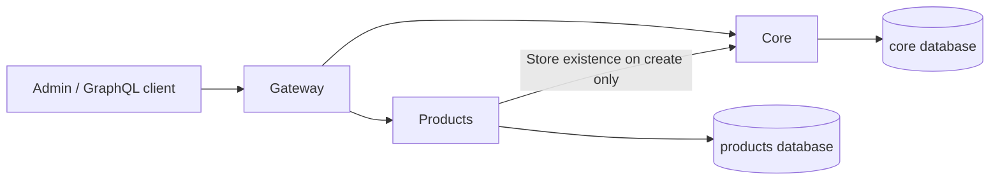

# Architecture

The repository uses npm workspaces for dependency installation and Nx for project tasks,
local caching and affected selection. Each application has a package.json and a small
project.json giving Nx its stable name and application tag. There are no shared workspace
packages or cross-application code imports.

| Application | Framework                       | Current entry points                                      |
| ----------- | ------------------------------- | --------------------------------------------------------- |
| admin       | React, Vite, Refine, Ant Design | Store selection and Products UI at http://127.0.0.1:11081 |
| gateway     | NestJS, Apollo Gateway          | /graphql and /health on 127.0.0.1:11080                   |
| core        | NestJS, Federation 2            | /graphql (stores) and /health on 127.0.0.1:11082          |
| products    | NestJS, Federation 2            | /graphql (products) and /health on 127.0.0.1:11083        |

Core owns store listing/lookup; products owns Products CRUD. Their concrete feature
repositories access their own PrismaService, whose client connects lazily and disconnects
on shutdown. Health endpoints stay independent of databases and downstream availability.
Admin uses one Refine GraphQL data provider with generated named operation documents,
store-scoped resources and standard Ant Design controls.

The gateway delegates requested Product.store fields to core through federation. That
requested field creates a core dependency; product-only list/read/update/delete do not.
Gateway configuration disables Apollo's anonymous metrics collection with its supported
APOLLO_TELEMETRY_DISABLED setting, including automatic cloud metadata detection.

## Execution and ownership

Root dev scripts use the existing concurrently package to run application scripts with
labels and group shutdown. Backend entry points validate PORT, bind to 127.0.0.1 and enable
Nest shutdown hooks. Vite binds to 127.0.0.1 with strictPort so a busy port is not silently
replaced with another. Application-local .env files can override backend ports.

ESLint's Nx boundary rule prohibits application-to-application imports. Feature code stays
inside its application; shared test configuration is the root jest.preset.mjs, not a
runtime library. Runtime communication follows GraphQL contracts, not application source
imports. Shared SDL/operation/tool inputs express their impact on Nx tasks.
Nx also records admin → gateway, products → core and gateway → core/products runtime dependencies for
affected selection, without permitting implementation imports across those boundaries.
Test targets explicitly use nx:run-commands to preserve file/case arguments, including
names containing spaces, when forwarding to the native npm test scripts.

## Task inputs

Lint, typecheck, build and unit-test targets use application files plus the root package
manifest/lockfile, TypeScript configuration, ESLint configuration, Jest preset, nx.json,
.nvmrc, Git/Nx ignore rules, workflow files and the active Node version as inputs.
Build output and caches are Git-ignored.
Shared configuration changes can affect every application; selection must reflect that.
Core/products also include Compose and tools/database changes in their task inputs.
Their lint/typecheck/build/test tasks depend on db-generate, which restores or regenerates
the ignored Prisma client. Test-db is explicitly noncached because a live database result
must execute again. Root tools have a separate small typecheck, not a fifth application.
Every application also depends on graphql-generate. Generation targets explicitly use
the default named inputs, including root tooling and SDL/operations, and own only their
application's generated output. Gateway's test-db builds all three backends and runs the
whole-graph fixture from tools/graphql. It is noncached and uses dedicated test schemas.
Admin's noncached test-smoke target includes browser tooling inputs and builds all four
apps. Its Playwright fixture uses actual backends and a Vite test server on ephemeral ports.
Dev tasks are continuous and not cached.
Admin builds are also uncached because Vite embeds the gateway URL from process variables
or ignored local environment files. An old build must not silently retain another endpoint.
The Nx daemon is disabled; graph calculation runs within commands so local checks do not
depend on a separate background process.

[PR CI](../../.github/workflows/affected.yml) checks the event's base/head with full Git
history. Root-tool lint/type checks and offline schema checks run independently of project
selection. Affected applications select unit/DB targets; affected admin also selects its
browser smoke target. A separate [manual workflow](../../.github/workflows/full-regression.yml)
runs full regression. Both use the root npm commands with host Node processes and the same
PostgreSQL-only Compose file. See [testing](../testing.md#github-actions) for exact behavior.

## Persistence ownership

One local PostgreSQL instance contains independent core/products development databases
and corresponding test databases, each with a distinct owner/login. Gateway and admin
have no database client or credentials. Compose contains only PostgreSQL; provisioning,
migrations and seeds are host commands, separate from application startup.

Core's Store has a UUID, name (up to 200 characters) and createdAt/updatedAt timestamps.
Products' Product has a UUID, storeId UUID, name (up to 200 characters), sku (up to 100),
status DRAFT/ACTIVE (default DRAFT), and timestamps. Prisma generates UUIDs and maintains
updatedAt; createdAt has a database default. A case-sensitive unique (storeId, sku) index
allows the same SKU across stores. A (storeId, createdAt, id) index supports deterministic
store-scoped ordering. No cross-database foreign key links Product to Store.
Product service validation trims name/SKU, enforces nonempty values and limits, and
requires an explicit UUID store context. Prisma definitions alone are not authorization.

Each service owns its schema, SQL migration history and generated Prisma client. Seeds
insert stable fixtures without updating existing rows. Integration tests apply the same
SQL migrations inside a unique schema in the service's test database; cleanup removes
only that run's schema. See [database ownership](decisions/0002-database-ownership.md).

See [the workspace decision](decisions/0001-npm-workspaces-and-nx.md) and
[testing](../testing.md) for the associated workflow.

## GraphQL contracts and context

The source contracts are [core SDL](../../apps/core/src/stores/stores.graphql) and
[products SDL](../../apps/products/src/products/products.graphql). Backend signatures use
generated types; decorators register resolvers without defining a second code-first API.
Named frontend operations live near their features. Products' core lookup operation lives
in its own core client directory, with its own generated types/document.

Local Apollo composition produces a supergraph and a public schema from those files.
Operation validation and Codegen are offline. The gateway loads the static supergraph;
it does not introspect running subgraphs, poll a registry or validate every store.
See [the schema-first decision](decisions/0003-schema-first-federation.md).

| Operation                | Behavior                                                                                      |
| ------------------------ | --------------------------------------------------------------------------------------------- |
| stores                   | List all stores by name, then ID ascending; no selected store required                        |
| store(id)                | Lookup a UUID; unknown returns null, malformed returns BAD_USER_INPUT                         |
| products(offset, limit)  | Store-scoped items and total; defaults 0/20, limit 1..100; order createdAt then ID descending |
| product(id)              | Return the selected store's product or NOT_FOUND                                              |
| createProduct(input)     | Trim/validate name and SKU, default DRAFT; verify store via core before inserting             |
| updateProduct(id, input) | Update at least one supplied field; null values are invalid; no core existence call           |
| deleteProduct(id)        | Delete and return the selected store's product; no core existence call                        |

Name is 1..200 Unicode code points after trimming; SKU is 1..100 and case-sensitive.
NUL characters are rejected before store validation or persistence. These limits match
the form validation and PostgreSQL character columns. Status is
DRAFT or ACTIVE. Store IDs are absent from write inputs and cannot be reassigned. All
repository predicates and Product reference resolution include the active store. Foreign
IDs behave as NOT_FOUND on read/update/delete; representations cannot replace store
context or persisted fields. A valid unknown store lists zero items, while create fails
NOT_FOUND and writes nothing. There is no store deletion API or automatic store cache.

Each GraphQL HTTP request gets a fresh context. The gateway forwards x-store-id unchanged
for the owning feature to validate. x-request-id accepts 1..100 ASCII letters/digits or
`._:-`; otherwise a UUID is generated. Responses expose the ID, and execution errors carry
it in extensions.requestId. No process-global current store exists. Products reuses the
store-validation promise within one products HTTP request; there is no cross-request cache.

Core validation uses its generated GraphQL operation with a 3-second timeout. A failed
core request is SERVICE_UNAVAILABLE, distinct from an unknown store, and prevents writes.
Gateway subgraph requests have a 5-second timeout. With core stopped, product-only reads,
updates and deletes still work; creation and queries selecting Product.store fail clearly.

Expected Nest exceptions map to BAD_USER_INPUT, NOT_FOUND, CONFLICT or SERVICE_UNAVAILABLE.
Unexpected messages/stack traces are hidden from GraphQL clients; diagnostics keep request
IDs, error names and stack frames without logging complete request payloads. Clients must
check the GraphQL errors array even when HTTP status is 200. Schema/request errors can
return HTTP 400. No authentication, permissions layer or duplicate REST CRUD is present.

Products is the backend reference: SDL → resolver → service → concrete repository → Prisma.
It uses no generic CRUD base, duplicated handwritten API DTOs or cross-application model
imports. See [the backend skill](../../.agents/skills/holita-backend-feature/SKILL.md).

## Admin request and store lifecycle

The URL is the active store source: `/` lists stores, `/stores/:storeId/products` lists
products, `/create` adds a product and `/:productId/edit` edits one. Unavailable stores
show a selection message and do not trigger product requests. Store administration is absent.

[The data provider](../../apps/admin/src/data/data-provider.ts) adapts the official Refine
GraphQL provider's variables and response mappers to our generated documents. Components
use Refine useList/useOne/useCreate/useUpdate/useDelete. They do not fetch directly.
Each request creates a transport with captured x-store-id and a new x-request-id, with a
10-second timeout. URQL uses only fetchExchange; Refine/TanStack Query owns the only cache.
GraphQL errors are handled even on HTTP 200; network failures have a concise retry message.

The Refine product resource is `stores/<UUID>/products`, not a shared `products` resource
with mutable headers. Both query keys and native mutation invalidation therefore include
the initiating store. Every mutation passes that resource when submitted. Updates/deletes
are pessimistic, and synchronous guards prevent duplicate submissions. Query/mutation
retries are disabled; failed reads offer an explicit Retry button.

[StoreWorkspace](../../apps/admin/src/features/stores/store-workspace.tsx) keys the Products
subtree by store ID. Switching resets pagination, forms, confirmation dialogs and local
notifications and returns to the selected store's list. The route subtree is also keyed by
pathname so changing products or moving between create/edit within one store resets editor
mutation state. Per-call mutation callbacks belong
to the mounted editor/list; after unmounting they cannot redirect, notify or replace a new
editor's draft. Refine still invalidates the original resource. Pending operations may
complete on the server after navigation; changing stores does not cancel or retarget writes.

[ProductForm](../../apps/admin/src/features/products/product-form.tsx) is shared by create
and edit, with matching trimmed name/SKU limits, Draft/Active status, pending controls and
server errors. Products is the frontend reference, with no Dev Lab or duplicate data layer.
Notifications use Ant Design's store-scoped hook directly. Refine's automatic notifications
are disabled on these hooks; no unused global notification adapter is registered.
See [the admin skill](../../.agents/skills/holita-admin-feature/SKILL.md).
