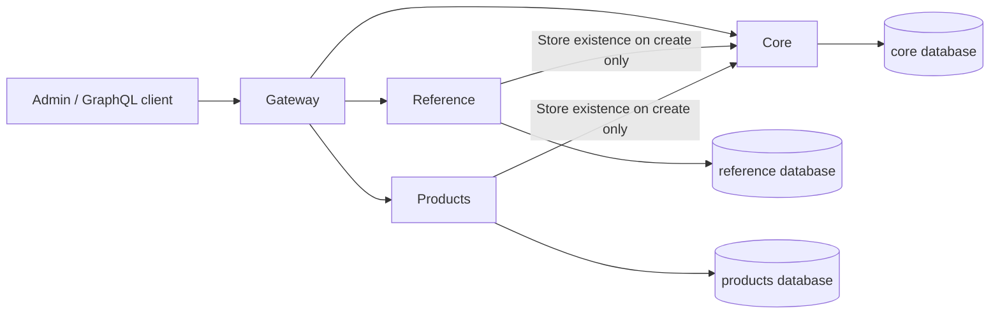

# Architecture

The repository uses npm workspaces for dependency installation and Nx for project tasks,
local caching and affected selection. Each application has a package.json and a small
project.json giving Nx its stable name and application tag. There are no shared workspace
packages or cross-application code imports.

| Application | Framework                       | Current entry points                                                                 |
| ----------- | ------------------------------- | ------------------------------------------------------------------------------------ |
| admin       | React, Vite, Refine, Ant Design | Stores, Products and Reference Events/Venues/Speakers/Tags at http://127.0.0.1:11081 |
| gateway     | NestJS, Apollo Gateway          | /graphql and /health on 127.0.0.1:11080                                              |
| core        | NestJS, Federation 2            | /graphql (stores) and /health on 127.0.0.1:11082                                     |
| products    | NestJS, Federation 2            | /graphql (products) and /health on 127.0.0.1:11083                                   |
| reference   | NestJS, Federation 2            | /graphql (events, venues, speakers, tags) and /health on 127.0.0.1:11086             |

Core owns store listing/lookup; products owns Products CRUD; reference owns Event, Venue, Speaker and Tag CRUD. Their concrete feature
repositories access their own PrismaService, whose client connects lazily and disconnects
on shutdown. Health endpoints stay independent of databases and downstream availability.
Admin uses one Refine GraphQL data provider with generated named operation documents,
store-scoped resources and standard Ant Design controls.

The gateway delegates requested Product.store fields to core through federation. That
requested field creates a core dependency; product-only list/read/update/delete do not.
Gateway configuration disables Apollo's anonymous metrics collection with its supported
APOLLO_TELEMETRY_DISABLED setting, including automatic cloud metadata detection.

## Execution and ownership

Root dev scripts use the existing concurrently package to run application scripts with
labels and group shutdown. Backend entry points validate PORT, bind to 127.0.0.1 and enable
Nest shutdown hooks. Vite binds to 127.0.0.1 with strictPort so a busy port is not silently
replaced with another. Application-local .env files can override backend ports.

ESLint's Nx boundary rule prohibits application-to-application imports. Feature code stays
inside its application; shared test configuration is the root jest.preset.mjs, not a
runtime library. Runtime communication follows GraphQL contracts, not application source
imports. Shared SDL/operation/tool inputs express their impact on Nx tasks.
Nx also records admin → gateway, products → core and reference → core and gateway → core/products/reference runtime dependencies for
affected selection, without permitting implementation imports across those boundaries.
Test targets explicitly use nx:run-commands to preserve file/case arguments, including
names containing spaces, when forwarding to the native npm test scripts.

## Task inputs

Lint, typecheck, build and unit-test targets use application files plus the root package
manifest/lockfile, TypeScript configuration, ESLint configuration, Jest preset, nx.json,
.nvmrc, Git/Nx ignore rules, workflow files and the active Node version as inputs.
Build output and caches are Git-ignored.
Shared configuration changes can affect every application; selection must reflect that.
Core/products/reference also include Compose and tools/database changes in their task inputs.
Their lint/typecheck/build/test tasks depend on db-generate, which restores or regenerates
the ignored Prisma client. Test-db is explicitly noncached because a live database result
must execute again. Root tools have a separate small typecheck, not an application.
Every application also depends on graphql-generate. Generation targets explicitly use
the default named inputs, including root tooling and SDL/operations, and own only their
application's generated output. Gateway's test-db builds all four backends and runs the
whole-graph fixture from tools/graphql. It is noncached and uses dedicated test schemas.
Admin's noncached test-smoke target includes browser tooling inputs and builds all five
apps. Its Playwright fixture uses actual backends and a Vite test server on ephemeral ports.
Dev tasks are continuous and not cached.
Admin builds are also uncached because Vite embeds the gateway URL from process variables
or ignored local environment files. An old build must not silently retain another endpoint.
The Nx daemon is disabled; graph calculation runs within commands so local checks do not
depend on a separate background process.

[PR CI](../../.github/workflows/affected.yml) checks the event's base/head with full Git
history. Root-tool lint/type checks and offline schema checks run independently of project
selection. Affected applications select unit/DB targets; affected admin also selects its
browser smoke target. A separate [manual workflow](../../.github/workflows/full-regression.yml)
runs full regression. Both use the root npm commands with host Node processes and the same
PostgreSQL-only Compose file. See [testing](../testing.md#github-actions) for exact behavior.

## Persistence ownership

One local PostgreSQL instance contains independent core/products/reference development databases
and corresponding test databases, each with a distinct owner/login. Gateway and admin
have no database client or credentials. Compose contains only PostgreSQL; provisioning,
migrations and seeds are host commands, separate from application startup.

Core's Store has a UUID, name (up to 200 characters) and createdAt/updatedAt timestamps.
Products' Product has a UUID, storeId UUID, name (up to 200 characters), sku (up to 100),
status DRAFT/ACTIVE (default DRAFT), and timestamps. Prisma generates UUIDs and maintains
updatedAt; createdAt has a database default. A case-sensitive unique (storeId, sku) index
allows the same SKU across stores. A (storeId, createdAt, id) index supports deterministic
store-scoped ordering. No cross-database foreign key links Product to Store.
Product service validation trims name/SKU, enforces nonempty values and limits, and
requires an explicit UUID store context. Prisma definitions alone are not authorization.

Each service owns its schema, SQL migration history and generated Prisma client. Seeds
insert stable fixtures without updating existing rows. Integration tests apply the same
SQL migrations inside a unique schema in the service's test database; cleanup removes
only that run's schema. See [database ownership](decisions/0002-database-ownership.md).

See [the workspace decision](decisions/0001-npm-workspaces-and-nx.md) and
[testing](../testing.md) for the associated workflow.

## GraphQL contracts and context

The source contracts are [core SDL](../../apps/core/src/stores/stores.graphql),
[products SDL](../../apps/products/src/products/products.graphql) and
[Reference Venue](../../apps/reference/src/venues/venues.graphql), [Event](../../apps/reference/src/events/events.graphql), [Speaker](../../apps/reference/src/speakers/speakers.graphql) and [Tag](../../apps/reference/src/tags/tags.graphql) SDL. Reference combines these explicit feature files at runtime and during offline composition. Backend signatures use
generated types; decorators register resolvers without defining a second code-first API.
Named frontend operations live near their features. Products' core lookup operation lives
in its own core client directory, with its own generated types/document.

Local Apollo composition produces a supergraph and a public schema from those files.
Operation validation and Codegen are offline. The gateway loads the static supergraph;
it does not introspect running subgraphs, poll a registry or validate every store.
See [the schema-first decision](decisions/0003-schema-first-federation.md).

| Operation                | Behavior                                                                                      |
| ------------------------ | --------------------------------------------------------------------------------------------- |
| stores                   | List all stores by name, then ID ascending; no selected store required                        |
| store(id)                | Lookup a UUID; unknown returns null, malformed returns BAD_USER_INPUT                         |
| products(offset, limit)  | Store-scoped items and total; defaults 0/20, limit 1..100; order createdAt then ID descending |
| product(id)              | Return the selected store's product or NOT_FOUND                                              |
| createProduct(input)     | Trim/validate name and SKU, default DRAFT; verify store via core before inserting             |
| updateProduct(id, input) | Update at least one supplied field; null values are invalid; no core existence call           |
| deleteProduct(id)        | Delete and return the selected store's product; no core existence call                        |

Name is 1..200 Unicode code points after trimming; SKU is 1..100 and case-sensitive.
NUL characters are rejected before store validation or persistence. These limits match
the form validation and PostgreSQL character columns. Status is
DRAFT or ACTIVE. Store IDs are absent from write inputs and cannot be reassigned. All
repository predicates and Product reference resolution include the active store. Foreign
IDs behave as NOT_FOUND on read/update/delete; representations cannot replace store
context or persisted fields. A valid unknown store lists zero items, while create fails
NOT_FOUND and writes nothing. There is no store deletion API or automatic store cache.

Each GraphQL HTTP request gets a fresh context. The gateway forwards x-store-id unchanged
for the owning feature to validate. x-request-id accepts 1..100 ASCII letters/digits or
`._:-`; otherwise a UUID is generated. Responses expose the ID, and execution errors carry
it in extensions.requestId. No process-global current store exists. Products reuses the
store-validation promise within one products HTTP request; there is no cross-request cache.

Core validation uses its generated GraphQL operation with a 3-second timeout. A failed
core request is SERVICE_UNAVAILABLE, distinct from an unknown store, and prevents writes.
Gateway subgraph requests have a 5-second timeout. With core stopped, product-only reads,
updates and deletes still work; creation and queries selecting Product.store fail clearly.

Expected Nest exceptions map to BAD_USER_INPUT, NOT_FOUND, CONFLICT or SERVICE_UNAVAILABLE.
Unexpected messages/stack traces are hidden from GraphQL clients; diagnostics keep request
IDs, error names and stack frames without logging complete request payloads. Clients must
check the GraphQL errors array even when HTTP status is 200. Schema/request errors can
return HTTP 400. No authentication, permissions layer or duplicate REST CRUD is present.

Products is the backend reference: SDL → resolver → service → concrete repository → Prisma.
It uses no generic CRUD base, duplicated handwritten API DTOs or cross-application model
imports. See [the backend skill](../../.agents/skills/holita-backend-feature/SKILL.md).

## Admin request and store lifecycle

The URL is the active store source: `/` lists stores, `/stores/:storeId/products` lists
products, `/create` adds a product and `/:productId/edit` edits one. Unavailable stores
show a selection message and do not trigger product requests. Store administration is absent.

[The data provider](../../apps/admin/src/data/data-provider.ts) adapts the official Refine
GraphQL provider's variables and response mappers to our generated documents. Components
use Refine useList/useOne/useCreate/useUpdate/useDelete. They do not fetch directly.
Each request creates a transport with captured x-store-id and a new x-request-id, with a
10-second timeout. URQL uses only fetchExchange; Refine/TanStack Query owns the only cache.
GraphQL errors are handled even on HTTP 200; network failures have a concise retry message.

The Refine product resource is `stores/<UUID>/products`, not a shared `products` resource
with mutable headers. Both query keys and native mutation invalidation therefore include
the initiating store. Every mutation passes that resource when submitted. Updates/deletes
are pessimistic, and synchronous guards prevent duplicate submissions. Query/mutation
retries are disabled; failed reads offer an explicit Retry button.

[StoreWorkspace](../../apps/admin/src/features/stores/store-workspace.tsx) keys the Products
subtree by store ID. Switching resets pagination, forms, confirmation dialogs and local
notifications and returns to the selected store's list. The route subtree is also keyed by
pathname so changing products or moving between create/edit within one store resets editor
mutation state. Per-call mutation callbacks belong
to the mounted editor/list; after unmounting they cannot redirect, notify or replace a new
editor's draft. Refine still invalidates the original resource. Pending operations may
complete on the server after navigation; changing stores does not cancel or retarget writes.

[ProductForm](../../apps/admin/src/features/products/product-form.tsx) is shared by create
and edit, with matching trimmed name/SKU limits, Draft/Active status, pending controls and
server errors. Products and Reference use the same provider and store lifecycle.
Notifications use Ant Design's store-scoped hook directly. Refine's automatic notifications
are disabled on these hooks; no unused global notification adapter is registered.
See [the admin skill](../../.agents/skills/holita-admin-feature/SKILL.md).

## Reference Event Management

Reference owns a separate PostgreSQL database. Events, Venues, Speakers, Tags, Sessions and Media each have
an SDL, resolver, service and concrete repository. Public types and operations carry the
Reference prefix; Events, Venues, Speakers and Tags federate by ID with a Store field resolved through core. Sessions require an explicit parent Event and have no standalone federation reference.
The feature modules import DatabaseModule to share one PrismaService and connection pool.
All reads, writes and entity references require the active store. Root entity creation verifies
store existence through core, with one promise per store per request. Other operations
without a selected Store field remain available while core is stopped.

Root resource lists return items/total/offset/limit, default 0/20 and maximum 100. Events sort by start/ID
ascending and exclude soft-deleted records; supporting lists sort by creation/ID descending.
Venue, Speaker and Tag lists accept name search, active and up to 100 distinct selected IDs.
Search is case-insensitive and treats punctuation such as `%` and `_` literally. Selected-ID
lookup includes inactive records when active is
omitted and still applies store scoping. The admin fetches choices in pages of 20 and
resolves current selections separately; it never preloads an entire relation table.
Venue, Speaker and Tag pages share the small `LookupList` component for pagination, table
actions and delete confirmation. Their columns, forms and generated API mappings stay in
their feature folders.

Venue name (200), city (120), and two-letter countryCode are required; countryCode normalizes
to uppercase. Description (2000), address (300) and positive integer capacity are nullable.
Speaker has name (200), nullable email (254) and short biography (2000). Tag has name (100)
and a six-digit hex color; its trimmed name is case-sensitive and unique within a store.
All three have editable active flags defaulting to true. They can be hard-deleted only when
unreferenced. Inactive relations already saved on an Event may remain, but cannot be newly
assigned. An Event retains references when moved to trash, so those references still block
supporting-record deletion. Speakers are assigned to Sessions; the Event overview derives its unique speaker list from those assignments.

Events have title (200), immutable trimmed code (100), Draft/Published/Archived status,
In person/Online/Hybrid format, optional positive integer capacity, optional EUR budget,
featured, required start/end, optional registration dates and summary (500). Budget is
PostgreSQL Decimal(12,2), transported as an exact GraphQL String with up to two decimal places;
outputs always contain two places. Writes do not convert the amount through a JavaScript number;
read-only displays format the value with two fractional digits.
DateTime transports UTC instants; the admin displays and edits them in Europe/Sofia to
minute precision. Editing preserves an existing instant in either occurrence of the repeated
autumn hour; changing the calendar date recalculates its Sofia offset. Registration dates use
YYYY-MM-DD strings and PostgreSQL DATE columns.
Both registration dates must be supplied together, open ≤ close, and close must be no later
than the event's start calendar date in Sofia. Event end must be after start.

In person requires a Venue and clears the meeting URL. Online requires an http(s) URL and
clears the Venue. Hybrid requires both. Events have explicit many-to-many EventTag rows;
composite foreign keys include storeId for Venue and Tag ownership. Event plus Tag writes
are atomic. Scalar-only edits leave Tag and Session Speaker links untouched; only newly
assigned relations require active-record validation. Text is trimmed, limited in Unicode
code points and rejects NUL. Update omission
preserves fields; null clears nullable fields and is invalid for required fields. Empty
updates fail. Validation errors include bounded, allowlisted field path/message entries
in extensions.fieldErrors; Reference and gateway strip other exception details. The admin
retains only these fields and the request ID while using the official Refine provider.

Event `descriptionHtml` is nullable PostgreSQL TEXT and a generated GraphQL String field.
The service validates 100 KiB of UTF-8 input before sanitization and rejects NUL. It uses
sanitize-html with an explicit allowlist: p, br, h2, h3, strong, em, ul, ol, li and a;
only a.href and ol.start attributes survive. Pasted b/i normalize to strong/em. Links must
be absolute http(s) URLs without credentials; unsafe destinations are removed while their
text remains. Scripts, embeds, media, handlers and styles are stripped. Visually empty
content becomes null. Sanitized output must also fit 100 KiB so it can be edited again.
Creation and update store only the sanitized result, atomically with other Event fields
and Tag changes; omission preserves it and null clears it.

The admin uses a constrained Tiptap editor inside the ordinary Ant Design form, with no
separate save or storage format. DOMPurify restricts pasted HTML and HTML rendered in the
Overview to the same permitted formats, providing a browser boundary in addition to server
validation. Initial content is sanitized once per editor mount; external replacements and
pasted HTML are sanitized when received. The editor schema excludes unsupported formatting,
embeds and source editing.
Editor content, selection, undo history and pending state belong to the existing route/store
subtree. The generated list fragment excludes descriptionHtml; detail and mutation operations
request it. No new shared CRUD layer or cross-service implementation imports are introduced.
Gateway and Reference use a 1 MiB JSON body limit to accommodate the description's 100 KiB
UTF-8 contract plus JSON escaping. This does not enable binary GraphQL uploads.

`deleteReferenceEvent` sets deletedAt and preserves relations and the unique store/code.
Ordinary lookup/update/delete and federation references return NOT_FOUND afterwards.
`referenceEvents(filter: { trashed: true })` selects only deleted rows; the default selects
only active rows. `referenceEvent(includeDeleted: true)` explicitly permits a scoped Trash
preview. `restoreReferenceEvent` clears deletedAt without changing status or references.
The code remains reserved, including while deleted. Sessions, media and uploads require an
active parent; restoring unlocks the preserved program and gallery. Import/export is absent.

### Event lifecycle and history

`setReferenceEventsStatus`, `trashReferenceEvents` and `restoreReferenceEvents` accept 1–100
unique explicit IDs from the active store. All IDs must exist and have the required lifecycle
state. A missing, foreign or ineligible row rejects the entire batch. Sorted parent row locks
serialize these actions with single-record, Session and Media writes. Bulk operations read
only IDs, statuses and deletion timestamps; they do not load descriptions or relations.
Updates and one batch history insert commit in one transaction; a history failure rolls back
the domain changes. Setting an already-current status succeeds without another history entry.
The result counts selected,
accepted IDs, including those whose status already matched.

The concrete `EventHistory` table belongs to Reference and has a composite store/Event
foreign key. It records Event creation/edits/trash/restore and committed Session/Media changes,
including saved ordering and covers. It has no public write API. Entries contain operation,
time, optional child title/filename, actor and changed fields. Actor is `Anonymous` while
there is no authentication. Failed writes and no-op edits do not add entries; existing/seeded
rows are not backfilled with invented history.

Field values are compared before truncation and stored as up to 500 characters plus an
ellipsis. Description history is a plain HTML excerpt rendered as escaped text. Relation
changes carry names and IDs. Upload capabilities, storage keys and signed URLs are excluded.
`referenceEventHistory` validates the scoped parent (including Trash) and paginates newest
first with an ID tie-breaker; page and total use a RepeatableRead transaction. This is a
working change log, without authenticated attribution, tamper-proof guarantees or retention
management.

The list header has Active/Trash tabs (`view=trash`), retained in its URL and return links.
Selection covers the visible page only and resets with URL or store changes. Confirmed
Publish, Archive and Trash operate on active selections; Restore operates on Trash selections.
A failed action preserves its selection for retry. Cache invalidation captures the original
store and selected IDs, while per-call UI callbacks stop after unmounting. The Show page
provides Overview, Sessions and History (`tab=history`); Trash exposes readonly details,
History and Restore while disabling Sessions and omitting gallery requests.

### Event media and direct uploads

[Media SDL](../../apps/reference/src/media/media.graphql) defines gallery metadata and upload
intents. Binary data never enters GraphQL or the Gateway. This follows the direct upload
separation described in [Apollo's upload guidance](https://www.apollographql.com/blog/file-upload-best-practices):

1. `createReferenceUploadIntent(eventId, input)` validates the scoped, live Event and records
   the generated key, display filename, expected bytes/type, token hash and expiry. It returns
   uploadId, fileKey, uploadUrl, method, required headers and expiresAt.
2. Admin sends the raw File to the returned PUT target using those headers. The local target
   is Reference's `/media/uploads/:id`; it accepts a random, single-purpose bearer capability,
   never a filename or mutable store header as storage authority.
3. `finalizeReferenceUpload(uploadId)` derives store/Event/key from the persisted intent,
   verifies stored bytes and atomically adds EventMedia. Repeating finalization returns the
   same image. Cover, alt text, ordering and removal use separate GraphQL mutations.

The storage contract is `MediaStorage`; `LocalMediaStorage` implements targets, verification,
read capabilities and deletion. No object storage provider or SDK is installed. The admin
consumes the returned method/URL/headers without a local-storage branch. Local storage runs
in one Reference process against a private host directory, not a static public mount.
Generated UUID keys pass a strict path check. Exclusive partial files are promoted without
replacing an existing final object. Finalized bytes are immutable; replacing an image means
adding another and removing the old one.

An Event allows 10 images including unexpired reservations. Each must be a still JPEG, PNG
or WebP, 1 byte–5 MiB and at most 20 megapixels. The endpoint bounds the actual stream and
Sharp decodes the entire image, verifies its format against the intent and rejects corrupt,
truncated or animated content. An upload capability expires after 10 minutes, permits one
claimed write and has a two-minute transfer timeout. Uploaded files must be finalized within
one hour of intent creation. Parent row locks serialize capacity, cover, order and deletion;
conditional intent state changes prevent finalization racing with cleanup. Composite foreign
keys bind media, upload and cover to the same store/Event.

The first image becomes cover. Reordering requires the complete distinct ID permutation and
leaves cover unchanged. Removing the cover selects the first remaining image or clears it.
Removal detaches metadata and marks its intent DELETING before physical deletion. A bounded
cleanup runs at startup and every minute (20 intents per pass). It claims expired/unattached
intents or pending deletions, excludes active transfers and finalized media, and retains keys
for retry when filesystem deletion fails. Crashed partial uploads become eligible on expiry.
Event soft deletion preserves finalized gallery files but blocks media access and mutations.

Gallery queries derive ten-minute read URLs; URLs are not database fields. Local reads verify
a signature and the current store/media/parent association, then stream with no-store,
nosniff and a restrictive content policy. The signing key is process-local: restart invalidates
old previews, and a fresh scoped query renews them. Admin refreshes metadata every eight
minutes while mounted and offers **Refresh previews**. Reference's feature guard also covers
both HTTP endpoints. These capabilities do not replace authentication; the existing foundation
still has no user authorization layer.

The gallery resource identity includes both store and Event. Refine owns metadata caching;
an upload hook captures that resource, uses an abortable XHR for progress and checks cancellation
before finalizing. Navigation aborts transport and suppresses obsolete local feedback. A
finalization already submitted retains its original scope. Gallery mutations save separately
from ordinary Event fields; reordering remains a draft until Save order, survives failure and
reloads server order on Cancel order. The Event editor's existing navigation warning includes
that draft, and Save event waits for gallery work to finish. Overview renders a read-only gallery.

Sessions belong to one Event and store. They have title (200), optional summary (2000),
optional room (120), UTC start/end, explicit zero-based position and many-to-many
SessionSpeaker links. Composite foreign keys include storeId for both the parent and
speakers. A session must end after it starts and fit wholly within the Event interval;
overlaps are allowed. Event date updates cannot exclude an existing session. New speaker
assignments must be active and in the same store; existing inactive assignments can remain
or be removed. Deleting a referenced Speaker fails, including when its Event is in trash.
Session deletion is permanent and removes its speaker links. Event soft deletion preserves
the program while blocking child reads and writes.

`referenceSessions(eventId)` returns the complete program in position/ID order, with a
maximum of 100 sessions per Event. Creation appends; editing times never changes order.
Creation reads the scoped count and maximum position without loading the existing program
or its speakers. `reorderReferenceSessions` accepts a complete, duplicate-free ID permutation of the current
parent collection and writes positions atomically. Stale membership produces CONFLICT.
Event updates and Session create/update/delete/reorder use a transaction holding the same
Event row lock before reading mutable state. This serializes membership, count and schedule
checks; the Event's soft-delete UPDATE uses that row lock as well. Services decide validation,
repositories own all scoped Prisma access, and the locking SQL qualifies the configured
schema. Session creation checks the existing scoped parent, without another Core request.

The Event header has Overview, Sessions (`tab=sessions`) and History tabs. Session forms use
`/events/:eventId/sessions/create` and `/events/:eventId/sessions/:id/edit` and return to the
Sessions tab after saving. Their Refine resource includes both store and Event IDs, so
requests, cache and invalidation retain both scopes. The program supports dragging and
keyboard-accessible move buttons. A draft order stays local until Save order; failed saves
retain it, and Cancel order reloads the server order. Add/edit/delete are disabled during
an order draft. Dirty navigation and reload use the same editor warning. Reorder uses a
concrete custom provider operation and a hook that invalidates the captured resource even
after navigation; success messages remain bound to the mounted program. The overview reads
this same bounded program to derive speakers; Event listing does not load Sessions.

`REFERENCE_ENABLED` accepts true/false and defaults to true. A resolver guard rejects
business queries, mutations and entity lookups with SERVICE_UNAVAILABLE when false.
Health and static federation composition remain available; disabling retains all data.
The matching public `VITE_REFERENCE_ENABLED` controls the admin menu/direct routes
at startup/build time. It is not authorization and cannot override the backend guard.

The admin routes are `/stores/:storeId/reference/{events,venues,speakers,tags}`, with
`/create` and `/:id/edit`; Events also have a `/:id` overview. Each concrete resource captures the store in requests, cache
keys and mutation invalidation. The Reference subtree is keyed by store and its routes by
pathname. Page headers contain context and applicable form tabs, with blue primary and red
destructive actions. Event fields are organized into General, Schedule & location, and
Content; one save validates all tabs and preserves failed input. A server error opens the
matching tab and focuses the first recognized field. Unknown error paths do not change the selected tab.
Venue retains General/Location tabs; Speaker and Tag use compact forms. Event creation
opens the saved Event editor; subsequent Event saves return to its overview. Supporting
saves return to their list.

The admin initializes a React Router data router so Reference editors can use its standard
navigation blocker. Dirty ordinary fields prompt on Cancel, menu links, store switching and
history navigation. Reload/close uses the browser's native beforeunload warning. Tabs stay
within the form. Submitted writes do not block navigation and keep their original scope;
late callbacks cannot replace another mounted editor. Failed saves retain dirty state.
Products retains its existing behavior without a dirty-form prompt.

The Event list accepts explicit `ReferenceEventFilter` and `ReferenceEventSort` inputs.
Title/code substring search is case-insensitive and treats SQL wildcard characters literally.
Status, format, venue IDs, tag IDs, featured, start-time boundaries and capacity bounds combine
with AND; alternatives in each selected-ID/enum list combine with OR. Venue/Tag filters include
inactive records, while creation/edit selectors continue to offer active choices. Foreign
relation IDs never match another store. The repository includes Venue and Tag data with Events;
these fields do not perform a separate resolver query for each row.

Sorting supports title, start, status, capacity, budget and creation time. Status uses the
stored enum order Draft, Published, Archived. All sorts have an ascending ID tie-breaker;
capacity and budget put nulls last in either direction. The default is start ascending.
The page and matching count share a RepeatableRead transaction. Page sizes are 10/20/50/100,
with 20 as default. Start-date filters represent inclusive calendar days in Europe/Sofia;
the admin converts these to `startsAtFrom` inclusive and `startsAtBefore` exclusive UTC
instants, including days shortened/lengthened by daylight saving changes.

Search, filters, Active/Trash view, sort, page and size are URL query parameters. Event links carry the list query
in `list`, interpreted only within the current store's Event list. Reload and browser history
restore the view; Show, Edit and Back retain this address. Store switching starts a default list.
Visible columns are local browser preferences keyed by the store's resource, without account
identity. Event and Actions remain visible; all other columns can be toggled. Reset filters
preserves Active/Trash, sorting, page size and columns; Reset columns restores the default columns. Lists
separate loading, an empty store, no matching rows and retryable failures.

The Event overview displays saved summary, tags, schedule, location, registration and record
details in cards. Its header contains context and its tabs. Edit opens the existing
form; Publish/Archive use the scoped status action and Move to trash uses confirmed deletion. These actions retain the same route/store mutation lifecycle as editors.
